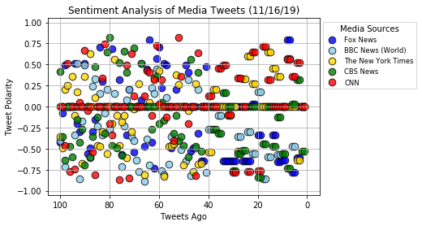
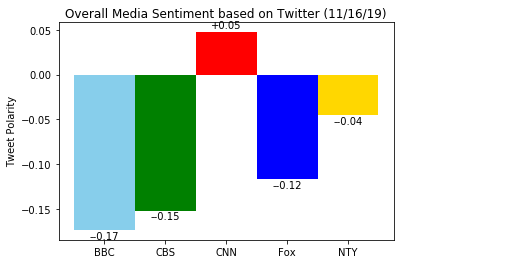

# News-Mood
Tweepy, vaderSentiment

For each of the chosen news sources, call 100 of their latest tweets and analyze their sentiment. Using their compound scores, generate a scatter plot for each of the points for all sources. Finally, create a summary bar plot to show each news source's tweets' average compound scores.

